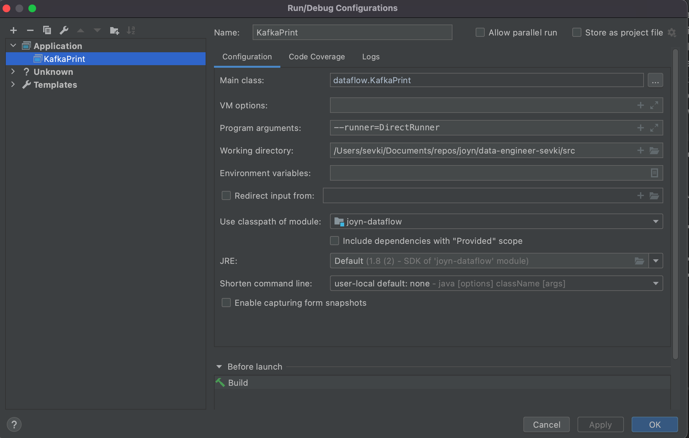

# Java Apache Beam Boilerplate

In this repository, you can find an example implementation for a stream processor, that is an Apache Beam app written in Java.
You can use two scripts written in Python to create and consume Kafka messages, and test if Kafka is working properly.
You need to use `docker-compose` client to download and run Kafka services in Docker. Make sure that you have installed docker and docker-compose clients.
This job collects the latest point of a watcher for every movie she is watching. Please see the kafka producer script for details.

## Preparing Python environment
First run install for necessary python packages. Create a virtual enviroment or you can work globally.
```
pip install -r requirements.txt
```
Run the below command to start necessary Kafka services. 
```
docker-compose up
```
If you see errors on the console about Kafka, cancel the session and retry the command. Kafka and zookeper takes time to get up at first start.

In two seperate terminal sessions, run scripts seperately and make sure kafka is working properly.
```
# terminal 1
python kafka_producer.py

# terminal 2
python kafka_consumer.py
```
When you are sure that Kafka is working properly, you can close the consumer script and start the Dataflow job.

## Apache Beam Dataflow job
You should have maven installed, or be able to setup Intellij editor for Beam debugging.
You should be able to see the log files after the windowing time (60 secs) passed under `src/main/output/latest_position_logs*`

### Run Dataflow using maven
Build the repo using a java editor then, in the main folder, run the app using maven
```
mvn compile exec:java -Dexec.mainClass=dataflow.KafkaPrint \
    -Pdirect-runner
```

### Debug Dataflow Code
Open Intellij Editor.
Right click and select the `src` folder as source.

Make sure you have Java 8 or later version. In the intellij editor, create a new configuration as application, then select the main folder as working directory,
then select the default JRE in the configurations. Select the KafkaPrint class from the `src` folder, add `--runner=DirectRunner` param to the run params, and save the configuration.
You should have a configuration like this:


If the editor prompts to add a new sdk, check the ready to use SDK and continue.

You can start debugging the code in the editor at this point.

## Assumptions

- Docker instances are used for Kafka services. Default Kafka config is used.
- Timestamp field is coming in the format `%Y-%m-%dT%H:%M:%S` without timezone.
- A topic is for a single user so in the pipe the data is just grouped by movie id.
- The memory configuration of executors should be able to handle the load of a one-minute-window.
- The windowing is done by processing time, not the event time.
